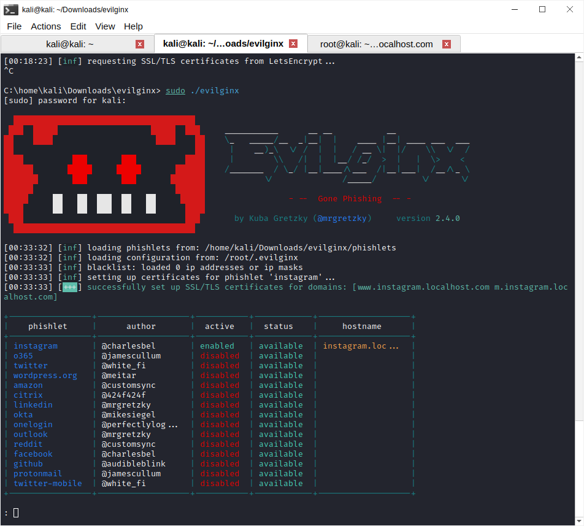
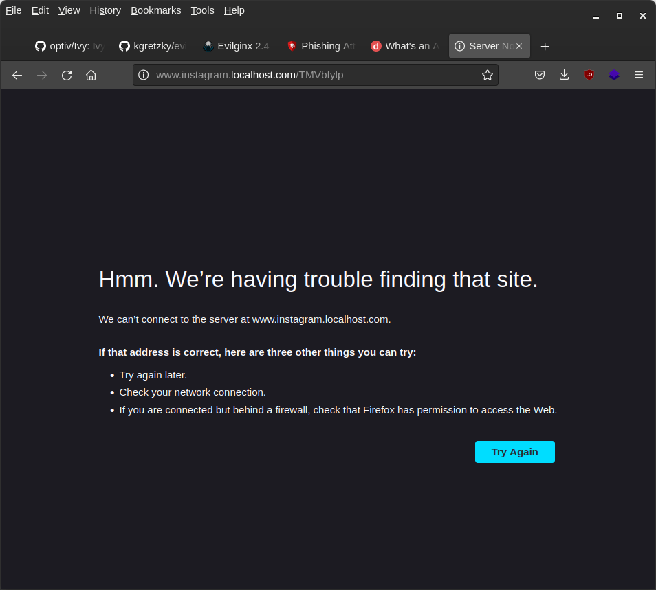

when trying to create evilphishlet we encounter a problem

```
[23:54:05] [!!!] acme: error: 400 :: POST :: https://acme-v02.api.letsencrypt.org/acme/new-order :: urn:ietf:params:acme:error:rejectedIdentifier :: Error creating new order :: Cannot issue for "m.instagram.localhost": Domain name does not end with a valid public suffix (TLD) (and 1 more problems. Refer to sub-problems for more information.), problem: "urn:ietf:params:acme:error:rejectedIdentifier" :: Error creating new order :: Domain name does not end with a valid public suffix (TLD), problem: "urn:ietf:params:acme:error:rejectedIdentifier" :: Error creating new order :: Domain name does not end with a valid public suffix (TLD), url:
```

so maybe we can change the localhost to localhost.com on `/etc/hosts`

however this producedanother issue

```
3:56:59] [inf] server domain set to: localhost.com
: config

 domain              : localhost.com
 ip                  : 127.0.0.1
 redirect_key        : jt
 verification_key    : kt
 verification_token  : 2e84
 redirect_url        : https://www.youtube.com/watch?v=dQw4w9WgXcQ

: phishlets hostname instagram instagram.localhost.com
[23:57:24] [inf] phishlet 'instagram' hostname set to: instagram.localhost.com
[23:57:24] [inf] disabled phishlet 'instagram'
: phishlets enable instagram
[23:57:34] [inf] enabled phishlet 'instagram'
[23:57:34] [inf] setting up certificates for phishlet 'instagram'...
[23:57:34] [war] failed to load certificate files for phishlet 'instagram', domain 'instagram.localhost.com': open /root/.evilginx/crt/instagram.localhost.com/instagram.crt: no such file or directory
[23:57:34] [inf] requesting SSL/TLS certificates from LetsEncrypt...
[23:57:54] [!!!] acme: Error -> One or more domains had a problem:
[m.instagram.localhost.com] acme: error: 400 :: urn:ietf:params:acme:error:dns :: DNS problem: NXDOMAIN looking up A for m.instagram.localhost.com - check that a DNS record exists for this domain; DNS problem: NXDOMAIN looking up AAAA for m.instagram.localhost.com - check that a DNS record exists for this domain, url:                          
[www.instagram.localhost.com] acme: error: 400 :: urn:ietf:params:acme:error:dns :: DNS problem: NXDOMAIN looking up A for www.instagram.localhost.com - check that a DNS record exists for this domain; DNS problem: NXDOMAIN looking up AAAA for www.instagram.localhost.com - check that a DNS record exists for this domain, url:        
```

in order to understand this les understand what is DNS record in the  first place

`/root/.evilginx/crt/instagram.localhost.com/instagram.crt`

or we can add our own certificate

```
openssl req -x509 \
-sha256 -days 356 \
-nodes \
-newkey rsa:2048 \
-subj "/CN=demo.mlopshub.com/C=US/L=San Fransisco" \
-keyout rootCA.key -out rootCA.crt
```

```
 cp rootCA.crt instagram.crt   
```

```
openssl genrsa -out instagram.key 2048
```

```
cat > csr.conf <<EOF
[ req ]
default_bits = 2048
prompt = no
default_md = sha256
req_extensions = req_ext
distinguished_name = dn

[ dn ]
C = US
ST = California
L = San Fransisco
O = Instagram
OU = Instagram Dev
CN = instagram.localhost.com

[ req_ext ]
subjectAltName = @alt_names

[ alt_names ]
DNS.1 = instagram.localhost.com
DNS.2 = www.instagram.localhost.com
IP.1 = 127.0.0.1
IP.2 = 127.0.0.1

EOF
```

```
cat > cert.conf <<EOF

authorityKeyIdentifier=keyid,issuer
basicConstraints=CA:FALSE
keyUsage = digitalSignature, nonRepudiation, keyEncipherment, dataEncipherment
subjectAltName = @alt_names

[alt_names]
DNS.1 = instagram.localhost.com

EOF


```

```
openssl x509 -req \
    -in instagram.csr \
    -CA rootCA.crt -CAkey rootCA.key \
    -CAcreateserial -out instagram.crt \
    -days 365 \
    -sha256 -extfile cert.conf
```



but still unable ot open the lure



we were able to open the lure when the corresponding dns entry was added into our host file. Evilginx is working.

how to create our custom yaml file?

that needs to be seen.


