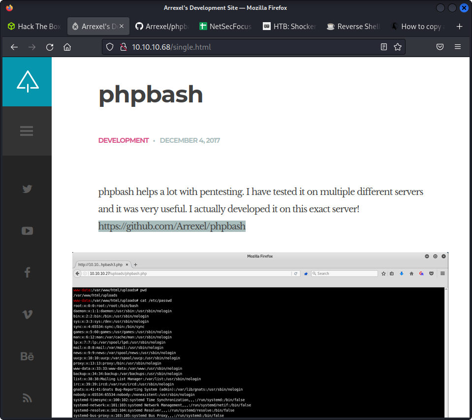
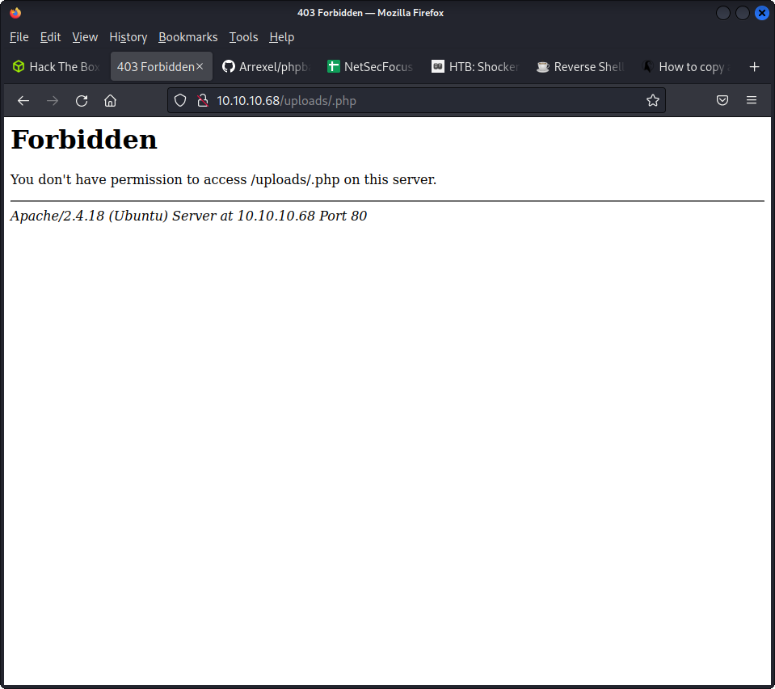

  

it mentions phpbash developed at arrexel
https://github.com/Arrexel/phpbash

```
└─$ nmap -sC -sV -Pn 10.10.10.68
Starting Nmap 7.92 ( https://nmap.org ) at 2023-02-11 12:43 EST
Stats: 0:02:04 elapsed; 0 hosts completed (1 up), 1 undergoing Connect Scan
Connect Scan Timing: About 30.03% done; ETC: 12:50 (0:04:51 remaining)
Nmap scan report for 10.10.10.68
Host is up (0.35s latency).
Not shown: 998 closed tcp ports (conn-refused)
PORT     STATE    SERVICE        VERSION
80/tcp   open     http           Apache httpd 2.4.18 ((Ubuntu))
|_http-server-header: Apache/2.4.18 (Ubuntu)
|_http-title: Arrexel's Development Site
3370/tcp filtered satvid-datalnk

```

we can http://10.10.10.68/uploads/

in the images we see that ther re is this directory


feroxbuster --url http://10.10.10.68/uploads -x php


  

no permission to upload it says

